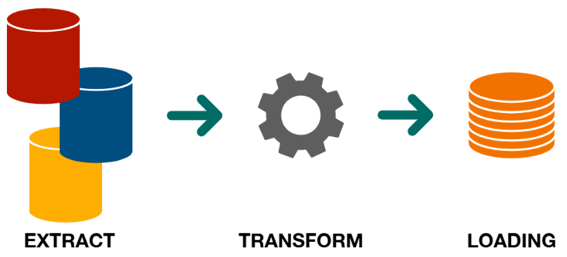
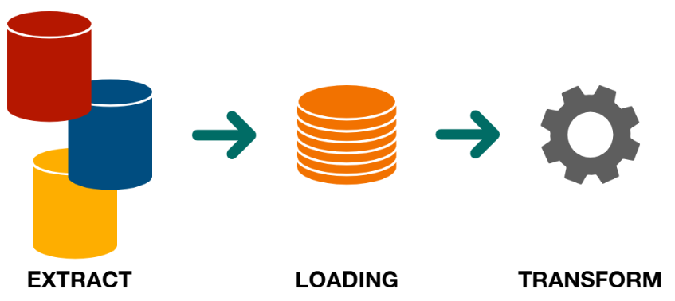

# 1. Processing

Processamento de dados é o conjunto de operações realizadas para transformar dados brutos em informações úteis, por meio de extração, transformação e carregamento, permitindo seu uso em análises, relatórios e aplicações.

---

- **1.1.** ETL (Extract, Transform, Load)

Processo em que os dados são extraídos, transformados (limpeza, enriquecimento, padronização) e depois carregados em um destino. A transformação ocorre antes do carregamento.

**✅ Prós:**
- Mais controle na transformação.
- Ideal para dados estruturados.
- Validação antes do carregamento.

**❌ Contras:**
- Processamento mais lento.
- Menos eficiente com grandes volumes.
- Exige infraestrutura intermediária.

--- 

- **1.2.** ELT (Extract, Load, Transform)

Processo em que os dados são extraídos, carregados no destino em seu formato original (bruto), e depois transformados diretamente nesse ambiente. A transformação ocorre após o carregamento.

**✅ Prós:**
- Escalável para Big Data.
- Usa o poder de processamento do destino.
- Arquitetura simplificada.

**❌ Contras:**
- Requer ambientes robustos.
- Menos controle pré-transformação.
- Pode dificultar a governança.

---

[🔗 Links - ETL/ELT](https://www.google.com/search?sca_esv=3f2684b5ae9554a2&sxsrf=AE3TifPenbEn4x-i47YaFcdcv9wTVd4h8g:1748463468476&q=etl+e+elt&source=lnms&fbs=AIIjpHxX5k-tONtMCu8aDeA7E5WMdDwGSuc8eBkl8hX51y2q67wchyM0b9808o1ULE6sPkQYx4dkhSBWF5tC9mMxJbXeel50vhxKVvX5QQl1e2-_NoGEkcTxu_BOmbIvEu2WE5rCdYVQhrU7qMDDRE0Ga3AQT2ljb0uHP62Qy6GgBFzF70RKSsqm1pLpOR-_iEPfZ5HGH4Z6uM5zdY2VNlkQix6PcPqEmuYzIf75B_pO8Gd2FCtol4I&sa=X&ved=2ahUKEwjvycP__caNAxVsF2IAHSYEFQAQ0pQJegQIExAB&biw=1280&bih=598&dpr=1.5)