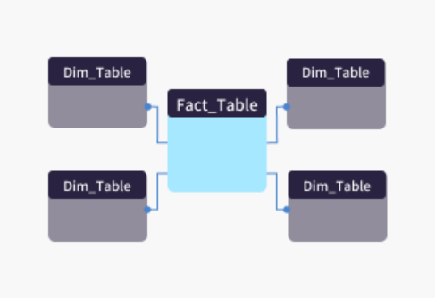
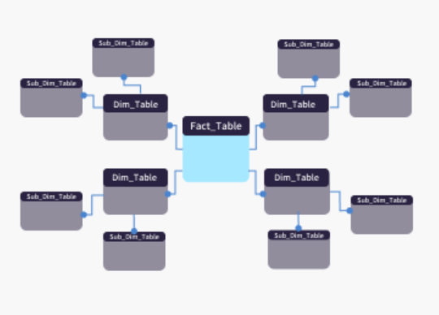
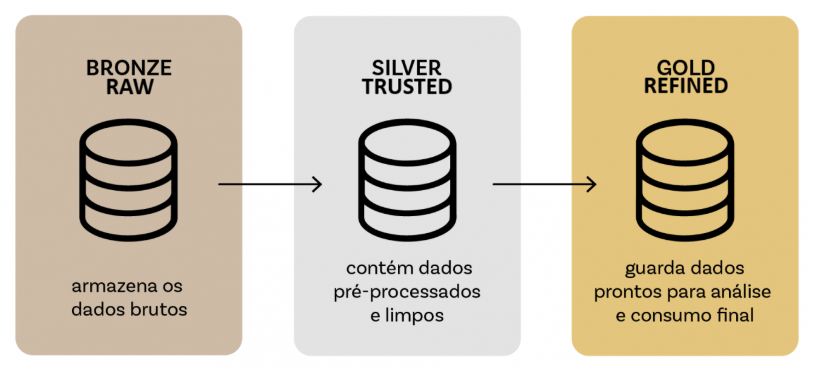

# 2. Modeling

Modelagem de dados é o processo de organizar e estruturar os dados de forma lógica, utilizando esquemas ou a arquitetura em camadas, para facilitar o desempenho das consultas, a consistência dos dados e a tomada de decisão.

---

- **2.1.** Star Schema 

Modelo em que uma única tabela fato central se conecta diretamente a várias tabelas dimensão.

- A tabela fato contém os dados numéricos (como vendas, lucros, quantidades).
- As tabelas dimensão trazem os detalhes descritivos (como cliente, produto, data, região).

**✅ Prós:**
- Simples de entender e implementar.
- Consultas mais rápidas.
- Ideal para ferramentas de BI.

**❌ Contras:**
- Redundância de dados nas dimensões.
- Menos eficiente para grandes volumes de dados complexos.

---

- **2.2.** Snowflake Schema  

É uma variação mais detalhada do Star Schema. Nele, as dimensões são organizadas em várias tabelas relacionadas. As dimensões são quebradas em outras tabelas menores e relacionadas entre si, o que evita repetição de dados e torna o modelo mais organizado.

**✅ Prós:**
- Evita repetição de dados (menos redundância).
- Estrutura mais organizada e detalhada.
- Ocupa menos espaço de armazenamento.

**❌ Contras:**
- Consultas mais lentas e complexas.
- Requer maior conhecimento técnico.
- Pode dificultar a visualização em ferramentas de BI.

---

- **2.3.** Medallion Architecture

Modelo de dados em camadas que organiza o processamento e a qualidade dos dados em três níveis:

- **Bronze**: dados brutos, tal como foram coletados.
- **Silver**: dados limpos e estruturados.
- **Gold**: dados prontos para análises e relatórios.

**✅ Prós:**
- Facilita o controle de qualidade dos dados por etapas.
- Estrutura reutilizável e escalável.
- Garante rastreabilidade e organização do fluxo de dados.

**❌ Contras:**
- Pode exigir mais armazenamento e processamento.
- Requer uma boa orquestração entre as camadas.

---

[🔗 Links - Star e Snowflake Schema](https://www.google.com/search?q=star+e+snowflake+schema&oq=star&gs_lcrp=EgZjaHJvbWUqBggAECMYJzIGCAAQIxgnMgkIARBFGDkYgAQyBwgCEC4YgAQyEAgDEC4YxwEYyQMY0QMYgAQyDAgEEAAYQxiABBiKBTIPCAUQLhgUGIcCGNQCGIAEMg8IBhAuGBQYhwIY1AIYgAQyBwgHEAAYgAQyBwgIEAAYjwLSAQk1MzQ5ajBqMTWoAgiwAgHxBSOGjHdDqY9q&sourceid=chrome&ie=UTF-8)

[🔗 Links - Medallion Architecture](https://www.google.com/search?q=arquitetura+de+dados+medalh%C3%A3o+defini%C3%A7%C3%A3o+do+google&sca_esv=3daf0913dc600547&sxsrf=AE3TifMf0oLFdrS0HU55AcSudFW8e0MFhQ%3A1748468641599&ei=oYM3aP2gJJSg5NoP6erbsAQ&ved=0ahUKEwi99aGikceNAxUUEFkFHWn1FkYQ4dUDCBA&uact=5&oq=arquitetura+de+dados+medalh%C3%A3o+defini%C3%A7%C3%A3o+do+google&gs_lp=Egxnd3Mtd2l6LXNlcnAiNGFycXVpdGV0dXJhIGRlIGRhZG9zIG1lZGFsaMOjbyBkZWZpbmnDp8OjbyBkbyBnb29nbGUyBRAhGKABMgUQIRigATIFECEYoAEyBRAhGKABSIAyUOkIWI4wcAF4AZABAJgBngGgAeQMqgEEMTguMrgBA8gBAPgBAZgCFaACnw3CAgoQABiwAxjWBBhHwgIGEAAYFhgewgIIEAAYgAQYogTCAgUQABjvBZgDAIgGAZAGCJIHBDE5LjKgB4VgsgcEMTguMrgHnA3CBwYwLjE4LjPIByw&sclient=gws-wiz-serp)
