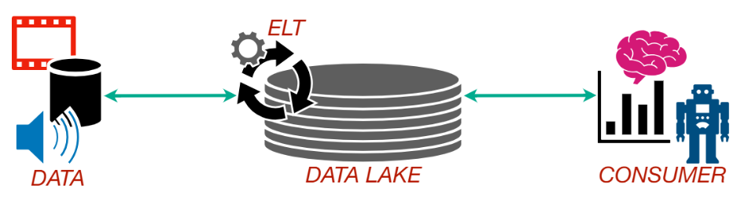
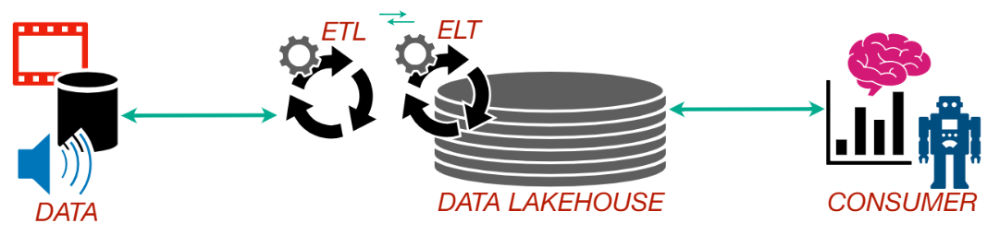

# 4. Storage

---

Armazenamento de dados refere-se à forma como os dados são guardados e organizados em repositórios, permitindo acesso eficiente, seguro e escalável para diferentes usos analíticos ou operacionais.

---

- **4.1.** Data Warehouse 

Armazena dados estruturados, gerenciados e prontos para análise, geralmente com esquemas bem definidos e alta performance em consultas analíticas.

**✅ Prós:**
- Alta performance para análises complexas.
- Qualidade e consistência de dados garantidas.
- Ideal para BI e relatórios corporativos.

**❌ Contras:**
- Custo elevado de armazenamento.
- Menos flexível para os dados.
- Exige transformação prévia dos dados.

---

- **4.2.** Data Lake 

Repositório centralizado que permite armazenar dados brutos em qualquer formato (estruturado, semiestruturado ou não estruturado).

**✅ Prós:**
- Flexível e escalável.
- Suporta diversos formatos de dados.
- Ideal para ciência de dados e machine learning.

**❌ Contras:**
- Gerenciamento mais complexo.
- Qualidade de dados pode ser inconsistente.
- Consultas geralmente menos performáticas.

---

- **4.3.** Data Lakehouse

Combina a estrutura de um Data Warehouse com a flexibilidade de um Data Lake, permitindo análises diretamente sobre dados brutos.

**✅ Prós:**
- Une a estrutura do Data Warehouse com a flexibilidade do Data Lake.
- Evita duplicação de dados entre ambientes.
- Atende tanto análises tradicionais (BI) quanto avançadas (ML).

**❌ Contras:**
- Pode demandar soluções e integrações especializadas.
- Requer governança mais cuidadosa.

---

[🔗 Links - Data Warehouse, Data Lake e Data Lakehouse](https://www.google.com/search?q=data+warehouse+data+lake+e+data+lakehouse+ggogle&sca_esv=8725bcfc7c963a92&biw=1280&bih=598&sxsrf=AE3TifOjMXKlW34-sS7fpeLFnqykQA1gOw%3A1748486413211&ei=Dck3aN_NDNCg5NoP1dyCgQw&ved=0ahUKEwifiLe808eNAxVQEFkFHVWuIMAQ4dUDCBA&uact=5&oq=data+warehouse+data+lake+e+data+lakehouse+ggogle&gs_lp=Egxnd3Mtd2l6LXNlcnAiMGRhdGEgd2FyZWhvdXNlIGRhdGEgbGFrZSBlIGRhdGEgbGFrZWhvdXNlIGdnb2dsZTIHECEYoAEYCjIHECEYoAEYCjIHECEYoAEYCjIHECEYoAEYCjIHECEYoAEYCki5HFCcBli3GXABeAGQAQCYAYABoAHKBKoBAzYuMbgBA8gBAPgBAZgCCKAC6ATCAgoQABiwAxjWBBhHwgIGEAAYFhgewgIIEAAYFhgKGB7CAgUQABjvBcICCBAAGIAEGKIEwgIFECEYoAGYAwCIBgGQBgiSBwM3LjGgB-IqsgcDNi4xuAfjBMIHBTAuNi4yyAcU&sclient=gws-wiz-serp)
