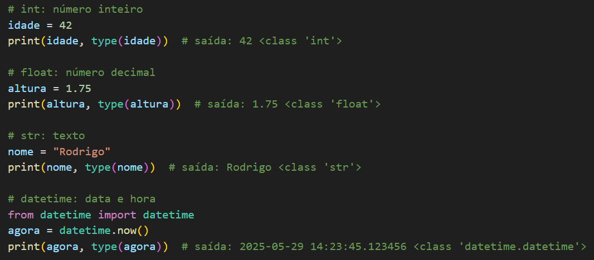
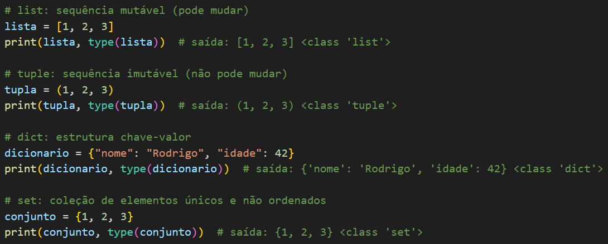
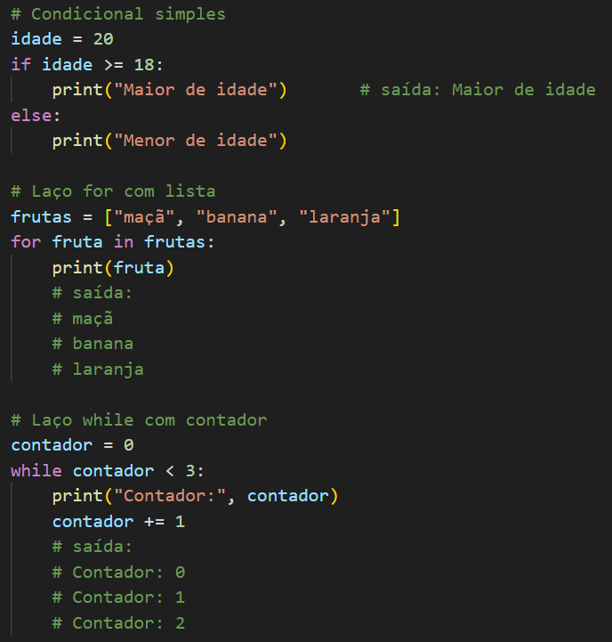
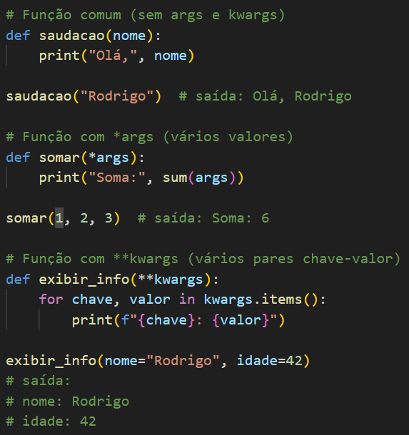
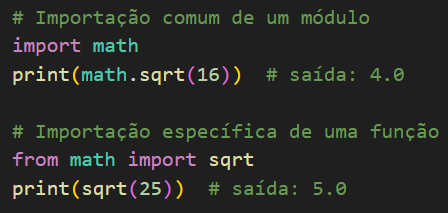
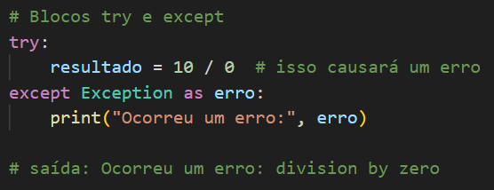
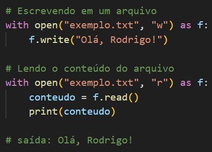
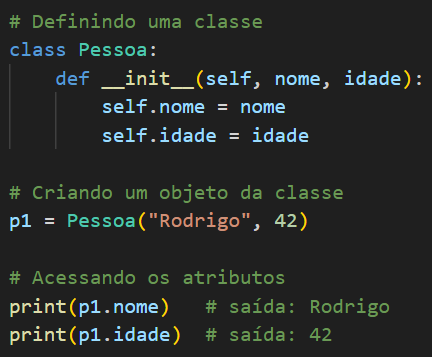

# 9. Python

Python é uma linguagem de programação de alto nível, interpretada, de tipagem dinâmica e com sintaxe simples, amplamente utilizada em automação, análise de dados, engenharia de dados e desenvolvimento de aplicações.

#### Objetivos

- Escrever códigos legíveis e de fácil manutenção  
- Automatizar tarefas e processos repetitivos  
- Manipular, transformar e analisar dados  
- Desenvolver scripts, APIs e aplicações completas  
- Integrar com bibliotecas e ferramentas de ciência de dados e engenharia

#### Tipos de Dados (principais)
- `int`: número inteiro
- `float`: número decimal
- `str`: texto 
- `datetime`: representa datas e horários

#### Estruturas de Dados
- `list`: sequência mutável (pode ser alterada) de elementos: [1, 2, 3]  
- `tuple`: sequência imutável (não pode ser alterada) de elementos: (1, 2, 3)   
- `dict`: estrutura chave-valor: {"nome": "Rodrigo", "idade": 42}
- `set`: coleção de elementos únicos e não ordenados: {1, 2, 3} 

#### Estruturas de Controle
- Condicionais: `if`, `elif`, `else`  
- Laços: `for`, `while` 

#### Funções
- Definição: `def`  
- Parâmetros padrão: 
    - `*args`: permite passar vários valores como uma lista
    - `**kwargs`: permite passar vários pares chave-valor como um dicionário

#### Módulos e Pacotes
- Importação: `import`, `from ... import ...` 

#### Tratamento de Erros (pricipais)
- Blocos: 
    - `try`: Tenta executar um trecho de código
    - `except`: Se der erro retorna uma exceção
- Tipos de exceções: 
    - `Exception`: Tipo **genérico** de erro

#### Manipulação de Arquivos
- Leitura e escrita: `with open(...)`  
- Tipos comuns de arquivos: `csv`, `json` e `txt`

#### Orientação a Objetos (POO)
- Classes: (`class`) -> classe é um modelo que define como um objeto deve ser
- métodos: (`__init__`) -> É o método que roda automaticamente quando criamos um novo objeto.
Serve para inicializar os dados da classe.

#### Bibliotecas Populares
- `pandas`: manipulação e análise de dados  
- `numpy`: operações matemáticas e numéricas  
- `requests`: faz requisições HTTP (ex.: acessar sites)  
- `os`: trabalhar com arquivos e pastas do computador  
- `datetime`: trabalha com datas e horários  
- `SQLAlchemy`: criar e gerenciar conexões e consultas a bancos de dados usando código Python  
