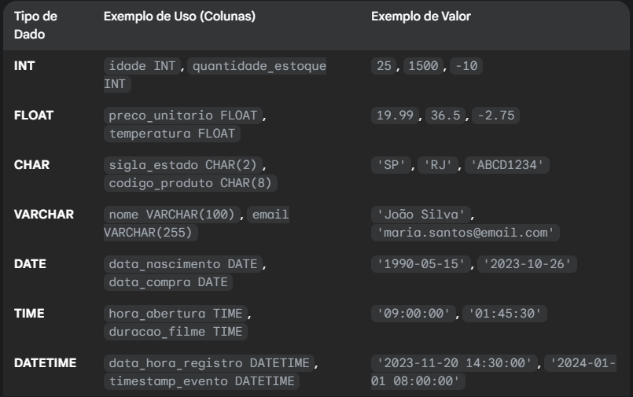

# 10. SQL

SQL (Structured Query Language) é uma linguagem padrão para gerenciamento de dados em bancos relacionais. Ela permite consultar, inserir, atualizar e excluir dados de forma estruturada.

#### Objetivos

- Consultar e filtrar dados em tabelas.  
- Inserir, atualizar e excluir registros.  
- Criar e modificar estruturas de banco de dados.  
- Trabalhar com junções e agregações de dados.  
- Garantir integridade e consistência das informações.

#### Tipos de Dados (principais)
- `INT`: número inteiro  
- `DECIMAL` / `FLOAT`: número decimal  
- `VARCHAR(n)`: texto com limite de caracteres  
- `DATE` / `DATETIME`: data e horário  
- `BOOLEAN`: verdadeiro ou falso  



#### Estruturas de Dados
- `tabela`: estrutura que armazena dados em linhas e colunas  
- `linha (registro)`: entrada individual de dados  
- `coluna`: define o tipo e o nome de cada campo  
- `PRIMARY KEY`: garantem unicidade dos valores  

#### Comandos Básicos
- `SELECT`: consulta dados  
- `INSERT INTO`: insere dados  
- `UPDATE`: atualiza dados  
- `DELETE`: remove dados  
- `CREATE TABLE`: cria nova tabela  
- `DROP TABLE`: exclui tabela  

```sql
-- CREATE TABLE: cria uma nova tabela chamada "clientes"
CREATE TABLE clientes (
    id INT PRIMARY KEY,
    nome VARCHAR(100),
    email VARCHAR(100),
    idade INT
);

-- INSERT INTO: insere um novo registro na tabela "clientes"
INSERT INTO clientes (id, nome, email, idade)
VALUES (1, 'Rodrigo Moura', 'rodrigo@email.com', 42);

-- SELECT: consulta todos os registros da tabela "clientes"
SELECT * FROM clientes;

-- UPDATE: atualiza o e-mail do cliente com id 1
UPDATE clientes
SET email = 'novoemail@email.com'
WHERE id = 1;

-- DELETE: remove o cliente com id 1
DELETE FROM clientes
WHERE id = 1;

-- DROP TABLE: exclui completamente a tabela "clientes"
DROP TABLE clientes;
```

#### Filtros e Operadores
- `WHERE`: aplica condição  
- Operadores: `=`, `<>`, `<`, `>`, `BETWEEN`, `LIKE`, `IN`, `IS NULL`  

```sql
-- WHERE com operador =
SELECT * FROM clientes
WHERE idade = 42;

-- WHERE com operador <> (diferentes)
SELECT * FROM clientes
WHERE nome <> 'Rodrigo Moura';

-- WHERE com operador <
SELECT * FROM clientes
WHERE idade < 50;

-- WHERE com operador >
SELECT * FROM clientes
WHERE idade > 18;

-- WHERE com operador BETWEEN (intervalo)
SELECT * FROM clientes
WHERE idade BETWEEN 18 AND 42;

-- WHERE com operador LIKE (padrão de texto)
SELECT * FROM clientes
WHERE nome LIKE 'Rodr%';  -- nomes que começam com "Rodr"

-- WHERE com operador IN (conjunto de valores)
SELECT * FROM clientes
WHERE idade IN (18, 25, 42);

-- WHERE com operador IS NULL (valores nulos)
SELECT * FROM clientes
WHERE email IS NULL;
```

#### Junções (JOINs)
- `INNER JOIN`: retorna apenas correspondências entre tabelas  
- `LEFT JOIN`: retorna todos da tabela principal e os correspondentes da outra  
- `RIGHT JOIN`: retorna todos da tabela secundária e os correspondentes da principal  
- `FULL JOIN`: retorna todos os registros de ambas as tabelas  


```sql
-- INNER JOIN: retorna registros que têm correspondência em ambas as tabelas
SELECT clientes.nome, pedidos.id AS pedido_id
FROM clientes
INNER JOIN pedidos ON clientes.id = pedidos.cliente_id;

-- LEFT JOIN: retorna todos os clientes e os pedidos correspondentes (se existirem)
SELECT clientes.nome, pedidos.id AS pedido_id
FROM clientes
LEFT JOIN pedidos ON clientes.id = pedidos.cliente_id;

-- RIGHT JOIN: retorna todos os pedidos e os clientes correspondentes (se existirem)
SELECT clientes.nome, pedidos.id AS pedido_id
FROM clientes
RIGHT JOIN pedidos ON clientes.id = pedidos.cliente_id;

-- FULL JOIN: retorna todos os clientes e todos os pedidos, combinando quando possível
SELECT clientes.nome, pedidos.id AS pedido_id
FROM clientes
FULL JOIN pedidos ON clientes.id = pedidos.cliente_id;
```

#### Funções Agregadas
- `COUNT()`: conta registros  
- `SUM()`: soma valores  
- `AVG()`: média  
- `MAX()` / `MIN()`: maior ou menor valor  


```sql
-- COUNT: conta o número de clientes
SELECT COUNT(*) AS total_clientes FROM clientes;

-- SUM: soma a idade de todos os clientes
SELECT SUM(idade) AS soma_idade FROM clientes;

-- AVG: calcula a idade média dos clientes
SELECT AVG(idade) AS media_idade FROM clientes;

-- MAX: encontra a maior idade entre os clientes
SELECT MAX(idade) AS maior_idade FROM clientes;

-- MIN: encontra a menor idade entre os clientes
SELECT MIN(idade) AS menor_idade FROM clientes;
```

#### Agrupamento e Ordenação
- `GROUP BY`: agrupa registros por coluna  
- `HAVING`: filtra após o agrupamento  
- `ORDER BY`: ordena os resultados  

```sql
-- GROUP BY: agrupa clientes por idade
SELECT idade, COUNT(*) AS total_clientes
FROM clientes
GROUP BY idade;

-- HAVING: filtra grupos com mais de 1 cliente
SELECT idade, COUNT(*) AS total_clientes
FROM clientes
GROUP BY idade
HAVING COUNT(*) > 1;

-- ORDER BY: ordena os clientes por idade em ordem crescente
SELECT * FROM clientes
ORDER BY idade ASC;

-- ORDER BY: ordena os clientes por idade em ordem decrescente
SELECT * FROM clientes
ORDER BY idade DESC;
```

#### Subconsultas e Aliases
- Subconsulta: consulta dentro de outra (`SELECT ... FROM (SELECT ...)`)  
- Alias: apelido para tabelas ou colunas com `AS`  

```sql
-- Subconsulta: seleciona clientes que têm idade maior que a média
SELECT nome, idade
FROM clientes
WHERE idade > (
    SELECT AVG(idade) FROM clientes
);

-- Alias para coluna: renomeia a coluna idade para "anos"
SELECT nome, idade AS anos
FROM clientes;

-- Alias para tabela: apelida a tabela clientes como "c"
SELECT c.nome, c.idade
FROM clientes AS c;
```

#### CTE (Common Table Expression)

- CTE é uma consulta temporária que pode ser referenciada dentro de uma consulta maior, facilitando a organização e leitura de queries complexas.  
- Usa a palavra-chave `WITH` para definir a CTE.

```sql
-- Exemplo de CTE que calcula a média de idade dos clientes e lista clientes acima da média
WITH media_idade AS (
    SELECT AVG(idade) AS idade_media
    FROM clientes
)
SELECT nome, idade
FROM clientes, media_idade
WHERE clientes.idade > media_idade.idade_media;
```

#### Boas Práticas
- Sempre usar `WHERE` ao atualizar ou deletar registros  
- Usar `LIMIT` para limitar resultados em testes  
- Criar `índices` para melhorar performance em grandes volumes de dados  
