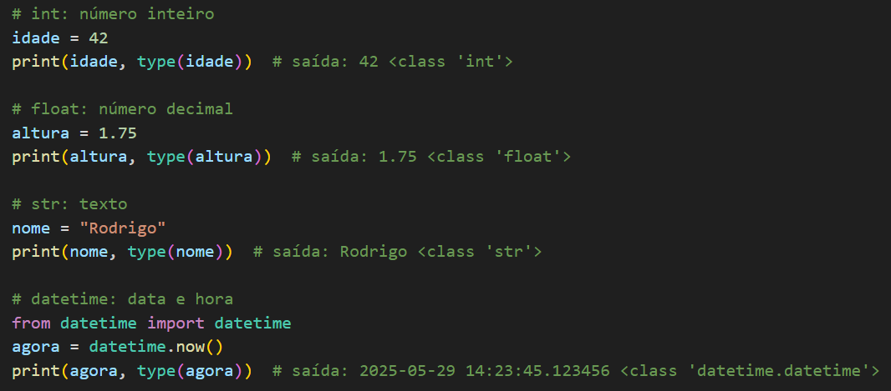
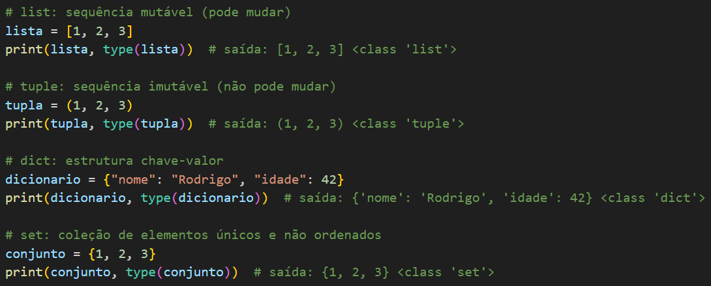
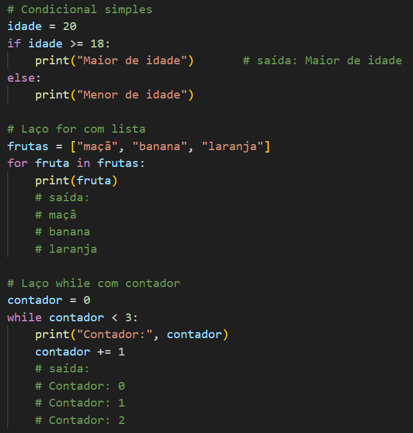
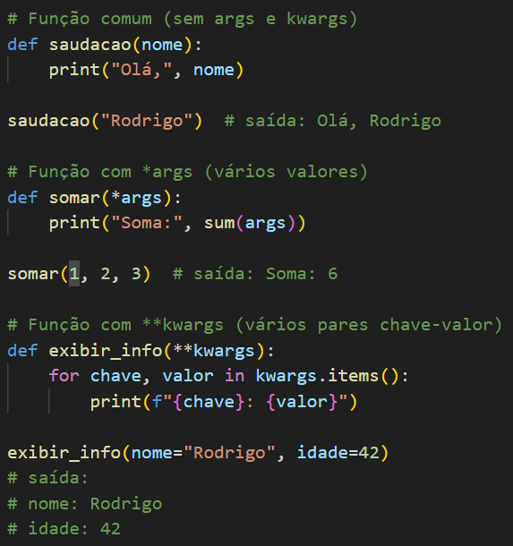
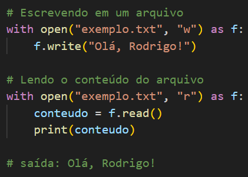
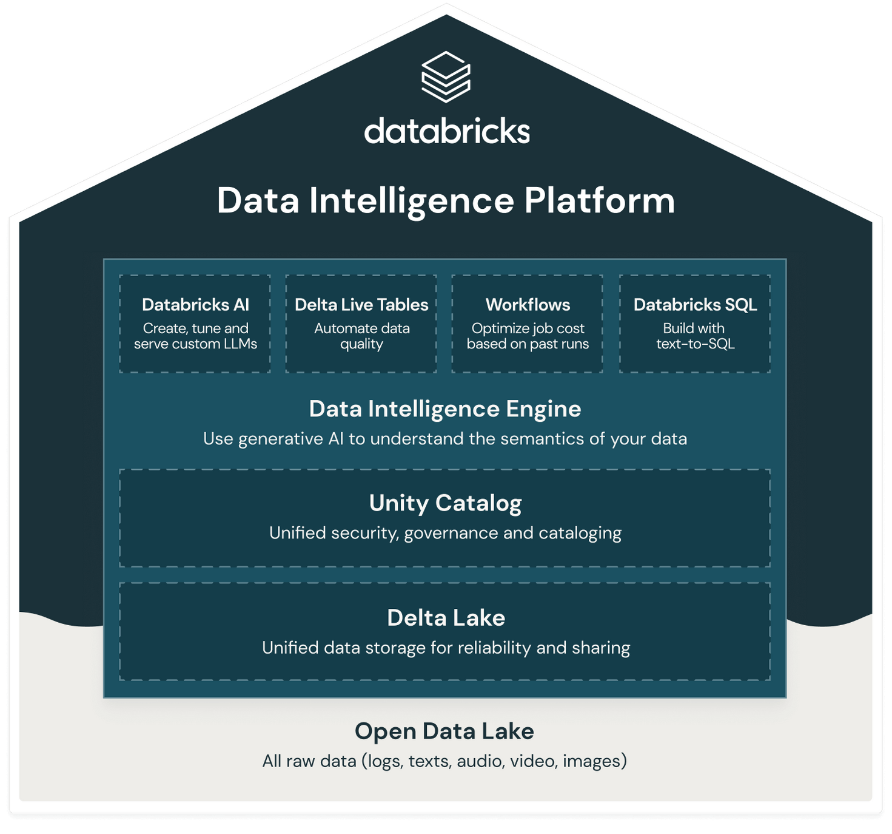

# 11. Spark

Apache Spark é uma ferramenta que ajuda a processar grandes volumes de dados de forma rápida e em várias partes ao mesmo tempo. É muito usada em projetos de Big Data por ser eficiente, escalável e ideal para lidar com muitos dados ao mesmo tempo.

#### Objetivos

#### Objetivos

- Ajudar a realizar tarefas pesadas mais rápido, dividindo-as em partes menores e distribuindo entre várias máquinas (**_Nós_**) que trabalham juntas em grupo (**_Cluster_**).  
- Permitir análises e mudanças em grandes quantidades de informações de forma rápida.  
- Organizar o caminho (**_Pipeline_**) que os dados fazem, desde a coleta até o uso final (**_ETL/ELT_**).  
- Trabalhar com diferentes tipos de arquivos, como planilhas, textos e registros em formatos variados (**_JSON, Parquet, CSV, entre outros_**).

#### Tipos de Dados (principais)
- `IntegerType`: número inteiro  
- `DoubleType`: número decimal  
- `StringType`: texto  
- `TimestampType`: data e hora  

#### Estruturas de Dados
- `DataFrame`: estrutura principal do Spark, equivalente a uma tabela  
- `RDD` (Resilient Distributed Dataset): coleção distribuída de objetos, usada em operações de baixo nível  
- `Row`: representa uma linha de dados dentro de um DataFrame  

#### Transformações e Ações
- **Transformações** (lazy): `select`, `filter`, `withColumn`, `join`  
- **Ações** (executam o código): `show`, `count`, `collect`, `write`  

#### Funções no Spark
- Funções SQL: `avg`, `sum`, `max`, `min`, `count`  
- Funções personalizadas: `udf` (User Defined Functions)  

#### Leitura e Escrita de Arquivos
- Leitura: `.read.format("csv/json/parquet")...`  
- Escrita: `.write.format("parquet").mode("overwrite")...`  

#### Partições e Performance
- `repartition(n)`: reorganiza os dados em `n` partições  
- `coalesce(n)`: reduz o número de partições, mais eficiente que `repartition`  
- Cache: `df.cache()` para acelerar acessos repetidos  

#### Integração com SQL
- Criar views temporárias: `df.createOrReplaceTempView("nome")`  
- Executar SQL: `spark.sql("SELECT * FROM nome")`  

#### Execução no Databricks
- Permite execução de notebooks interativos  
- Suporte nativo ao Delta Lake e workflows com notebooks agendados  
- Conectividade com Azure Data Lake, Blob, SQL, Synapse etc.

#### Bibliotecas Associadas
- `pyspark.sql`: manipulação de DataFrames e SQL  
- `pyspark.ml`: machine learning  
- `delta`: integração com Delta Lake  
- `pyspark.streaming`: processamento em tempo real  

