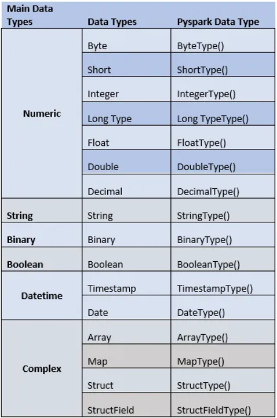

# 11. Spark

Apache Spark é uma ferramenta que ajuda a processar grandes volumes de dados de forma rápida e em várias partes ao mesmo tempo. É muito usada em projetos de Big Data por ser eficiente, escalável e ideal para lidar com muitos dados ao mesmo tempo.

#### Objetivos

#### Objetivos

- Ajudar a realizar tarefas pesadas mais rápido, dividindo-as em partes menores e distribuindo entre várias máquinas (**_Nós_**) que trabalham juntas em grupo (**_Cluster_**).  
- Permitir análises e mudanças em grandes quantidades de informações de forma rápida.  
- Organizar o caminho (**_Pipeline_**) que os dados fazem, desde a coleta até o uso final (**_ETL/ELT_**).  
- Trabalhar com diferentes tipos de arquivos, como planilhas, textos e registros em formatos variados (**_JSON, Parquet, CSV, entre outros_**).

#### Tipos de Dados (principais)
- `IntegerType`: número inteiro  
- `DoubleType`: número decimal  
- `StringType`: texto  
- `TimestampType`: data e hora  



#### Estruturas de Dados
- `RDD` (Resilient Distributed Dataset): Estrutura padrão do Spark. Manipula grandes volumes de dados, dividindo-os em partes menores para serem processados paralelamente (**_distribuido_**). Oferece mais controle, mas exige mais conhecimento técnico.

```python
# Creating an RDD
data = sc.parallelize([("Alice", 28), ("Bob", 23), ("Cathy", 25)])

# Filtering RDD
filtered_rdd = data.filter(lambda x: x[1] > 24)
print(filtered_rdd.collect())  

# Output: [('Alice', 28), ('Cathy', 25)]
```

- `DataFrame`: Estrutura de dados semelhante a uma tabela de banco de dados relacional, com linhas e colunas. Permite filtrar, ordenar e analisar grandes quantidades de informações de maneira fácil e rápida.

```python
from pyspark.sql import SparkSession

# Initialize SparkSession
spark = SparkSession.builder.appName("DataFramesExample").getOrCreate()

# Creating a DataFrame
data = [("Alice", 28), ("Bob", 23), ("Cathy", 25)]
columns = ["Name", "Age"]
df = spark.createDataFrame(data, columns)

# Filtering DataFrame
filtered_df = df.filter(df.Age > 24)
filtered_df.show()
```

- `Dataset`: Estrutura de dados que combina a praticidade do DataFrame com o controle do RDD. Organiza os dados em colunas, com mais segurança ao lidar com os tipos de informação. Porém, está disponível apenas em linguagens como Scala e Java, não funciona em Python.

```python
from pyspark.sql import SparkSession

# Initialize SparkSession
spark = SparkSession.builder.appName("UnifiedWorkflow").getOrCreate()

# Step 1: Create an RDD
rdd = spark.sparkContext.parallelize([("Alice", 28), ("Bob", 23), ("Cathy", 25)])

# Step 2: Convert RDD to DataFrame
columns = ["Name", "Age"]
df = rdd.toDF(columns)

# Step 3: Perform DataFrame operation
filtered_df = df.filter(df.Age > 24)

# Step 4: Convert DataFrame to Dataset (em Scala/Java)
# Em Python, DataFrame já funciona como Dataset (estrutura unificada)

filtered_df.show()
```

### CORRIGIR!!!

#### Transformações e Ações
- **Transformações** (lazy): `select`, `filter`, `withColumn`, `join`  
- **Ações** (executam o código): `show`, `count`, `collect`, `write`  


#### Funções no Spark
- Funções SQL: `avg`, `sum`, `max`, `min`, `count`  
- Funções personalizadas: `udf` (User Defined Functions)  


#### Leitura e Escrita de Arquivos
- Leitura: `.read.format("csv/json/parquet")...`  
- Escrita: `.write.format("parquet").mode("overwrite")...`  


#### Partições e Performance
- `repartition(n)`: reorganiza os dados em `n` partições  
- `coalesce(n)`: reduz o número de partições, mais eficiente que `repartition`  
- Cache: `df.cache()` para acelerar acessos repetidos  


#### Integração com SQL
- Criar views temporárias: `df.createOrReplaceTempView("nome")`  
- Executar SQL: `spark.sql("SELECT * FROM nome")`  


#### Execução no Databricks
- Permite execução de notebooks interativos  
- Suporte nativo ao Delta Lake e workflows com notebooks agendados  
- Conectividade com Azure Data Lake, Blob, SQL, Synapse etc.


#### Bibliotecas Associadas
- `pyspark.sql`: manipulação de DataFrames e SQL  
- `pyspark.ml`: machine learning  
- `delta`: integração com Delta Lake  
- `pyspark.streaming`: processamento em tempo real  


---

[🔗 Documentação Apache Spark (en)](https://spark.apache.org/docs/latest/)