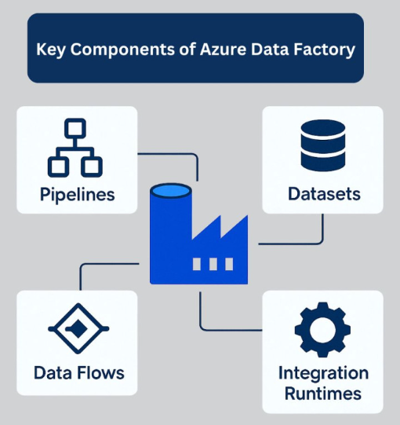

# 13. Azure Data Factory

Serviço da Microsoft que conecta e movimenta dados entre diferentes sistemas. Permite criar pipelines ETL e ELT de forma visual e automatizada, facilitando a transformação e organização dos dados.

---

- **13.1.** Pipelines de Ingestão

No Data Factory, criam-se pipelines que extraem dados de diferentes fontes (bancos, APIs, arquivos), realizam transformações com Data Flows ou serviços externos, e carregam os dados em destinos como Azure SQL ou Data Lake.

**✅ Prós:**
- Interface visual, sem necessidade de código.
- Fácil integração com serviços Azure.
- Ideal para agendamento e automação.

**❌ Contras:**
- Transformações complexas são limitadas nos Data Flows.
- Dependência de Linked Services bem configurados.
- Não é ideal para processamento pesado em tempo real.

---

- **13.2.** Integração com Databricks

O Data Factory pode orquestrar notebooks do Databricks dentro dos pipelines, combinando automação com processamento avançado.

**✅ Prós:**
- Integração direta com o Databricks.
- Automatiza fluxos de ponta a ponta.
- Controla execuções com logs e triggers.

**❌ Contras:**
- Depende de autenticação e integração prévias.
- Menor visibilidade em tempo real do que ocorre nos notebooks.

---

[🔗 Link – Azure Data Factory](https://learn.microsoft.com/pt-br/azure/data-factory/introduction)